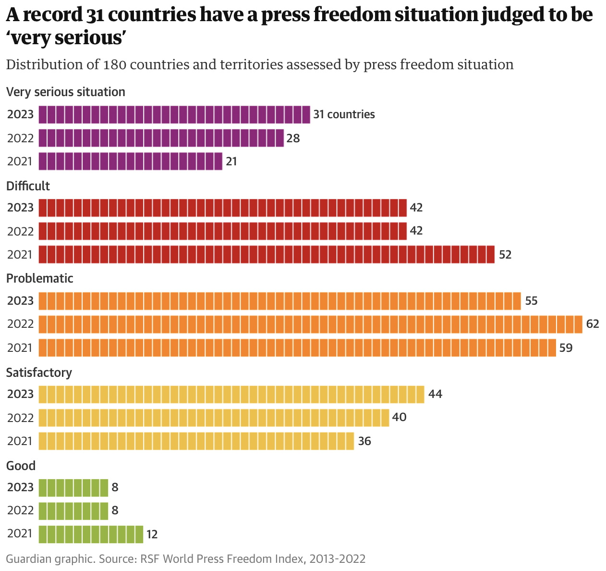

| [home page](https://davidzouz.github.io/tswd-portfolio/) | [visualizing debt](https://davidzouz.github.io/tswd-portfolio/visualizing-government-debt) | [critique by design](https://davidzouz.github.io/tswd-portfolio/critique-by-design) | [final project I] | [final project II] | [final project III] |

# Critique by Design with Tableau

Web Link: https://davidzouz.github.io/tswd-portfolio/critique-by-design

## Step one: the visualization

_Include link to the original data visualization (or screenshot - make sure to correctly cite your sources, etc.).  Include paragraph or two on why you selected this particular data visualization.  For obvious reasons, the data visualization you select should come from a publicly accessible source._

The article [**"Media freedom in dire state in record number of countries, report finds"**](https://www.theguardian.com/media/2023/may/03/media-freedom-in-dire-state-in-record-number-of-countries-report-finds?CMP=Share_iOSApp_Other) highlights the alarming decline in global press freedom, with a record number of countries being categorized as having a "very serious situation" regarding media freedom. The report from the World Press Freedom Index identifies disinformation, propaganda, and artificial intelligence as increasing threats to journalism.  Governments, including both autocratic and some democratic ones, are becoming more aggressive in undermining press freedom through disinformation campaigns, propaganda, and arrests of journalists. Notable declines were observed in countries like Russia, India, and Turkey, as well as in regions such as Africa and the Middle East. Meanwhile, Nordic countries continue to lead in press freedom, with Norway ranked first. The article concludes with concerns about rising populism and declining press freedom, even in traditionally safe regions like the EU.

I chose this dataset is its inherent(interest factor). The article presents a fascinating snapshot of how press freedom has evolved globally in recent years, particularly emphasizing the growing number of countries with a "very serious" press freedom situation. This dataset stands out because it highlights the tangible impact of political and technological developments—such as the rise of disinformation and artificial intelligence—on journalistic integrity. It's intriguing to see how even democratic nations are slipping into lower rankings. The dataset provokes questions about the future of free speech, the role of the media in upholding democracy, and the growing influence of authoritarianism. This makes it not only relevant but intellectually engaging, as it opens up discussions on how global trends are impacting fundamental freedoms that many might take for granted.

## Step two: the critique
_Don't forget to complete the Google Form found on the assignment page.  You can summarize your thoughts here._

The primary audience for this data visualization includes journalists, researchers, policymakers, and human rights advocates who are concerned about global press freedom trends. The visualization is partially effective for this audience, as it offers a clear overview of changes in press freedom over time. However, it lacks the depth of information that this audience might need to fully understand the shifts, such as country-specific insights and the reasons behind those changes. The chart shows high-level trends, but more detailed information or engagement features would make it significantly more useful, especially for those seeking actionable insights.

In terms of effectiveness, the evaluation method successfully assessed important aspects like truthfulness, completeness, and intuitiveness, but it missed key elements such as aesthetics, engagement, and the detailed usefulness of the chart. One major drawback of the visualization is that it doesn’t explain how countries are classified into different levels of press freedom, which raises a concern about completeness. The recommendations for improvement include adding country-specific annotations, providing interactive elements, and explaining the classification criteria to make the chart more informative, engaging, and trustworthy for the audience.

## Step three: Sketch a solution

## Step four: Test the solution

**Interview 1 (BIDA studnet, mid 20's):**

_Can you tell me what you think this is?_

The first line graph compares the average points of countries in terms of their press freedom situation from 2021 to 2023. It also shows the yearly trend of each country surveyed. The second graph shows the distribution of the 31 countries that are labeled “Very Serious” in terms of press freedom situation in 2023, how the situation was different back to 2021. 

_Can you describe to me what this is telling you?_

In the first graph, those countries above the average line are deemed having more a serious press freedom situation than those under the average line, which is a common sense too. The average line assists in comparing those countries. The second graph highlights that the number of countries rated “Very Serious” increases from 2021 to 2023, from 26 to 31, as an example, including those rated “Difficult”, “Problematic”, and “Satisfactory”.

_Is there anything you find surprising or confusing?_

For the first graph, is there a proper way to identify and label the countries either above or below the average line? Are they “Very Serious”, “Difficult”, “Problematic”, “Satisfactory”, or “Good” according to the criteria of second graph? The second graph takes some time to understand but it is a good way to show the flow of the press freedom situation over time.

_Who do you think is the intended audience for this?_

Journalists, people working in media industry, general public

_Is there anything you would change or do differently?_

The average line is one of the good ways to show how each country compared to average. If there are specific countries that needs to be pointed out, a highlight color can be used that is properly labeled. For the color pattern of second graph, consider using red for the worst situation (“Very Serious”) and green for the better one (“Good”), and blue in the middle.

**Interview 2 (MISM studnet, mid 20's):**

_Can you tell me what you think this is?_

First Graph: It is a line chart tracking the average score or ranking of countries labeled as "Very Serious" in terms of press freedom from 2021 to 2023. Second Graph (Sankey): This diagram visualizes the flow of countries between different categories of press freedom from "Very Serious" to "Good" over two years, 2021 and 2023.

_Can you describe to me what this is telling you?_

The first graph is depicting the general situation for the "Very Serious" category is worsening or improving over time. The Sankey diagram shows how countries progress or regress in press freedom, indicating possible global trends affecting the media.

_Is there anything you find surprising or confusing?_

It's a little bit unclear how many countries are represented in the first graph's individual lines, which could confuse the audiences about what exactly each line signifies. The transition numbers in the Sankey diagram might require clarification to help interpret.

_Who do you think is the intended audience for this?_

This visualization most likely targets policymakers, journalists, researchers interested in press freedom trends.

_Is there anything you would change or do differently?_

For the line chart, ensuring that the average line and individual country lines are distinctively marked and explained would avoid confusion. Adding clearer annotations could improve readability for the Sankey diagram.

------------------------------------------------------------------------------------------------------------------------------------------------

**Synthesis:** 

_What patterns in the feedback emerge?  What did you learn from the feedback?  Based on this feedback, come up with what design changes you think might make the most sense in your final redesign._

_Summary of Feedback:_

Both interviewers pointed out challenges with the clarity of the graphs. The first line chart was seen as confusing due to a lack of proper labeling and insufficient distinctions between lines. Similarly, the Sankey diagram was difficult to interpret, particularly regarding the transitions between press freedom categories over time. Both interviewers emphasized the need for improved visual design, suggesting clearer annotations and a more intuitive color scheme, such as red for "Very Serious" and green for "Good." They also noted that the visualizations target an audience of journalists, policymakers, and researchers, but stressed the importance of improving clarity to ensure these audiences can easily understand the presented trends.

_What I Learned from the Feedback:_

I learned that clarity and ease of interpretation are essential for effective data visualization, especially when addressing complex topics like press freedom. The feedback highlighted the need for more explicit labeling and clearer distinctions between data points to avoid confusion. It also emphasized the importance of using an intuitive color scheme to enhance readability, with familiar associations like red for "Very Serious" and green for "Good." Furthermore, while the visualizations are intended for a knowledgeable audience, improvements in visual communication are necessary to ensure that all viewers, regardless of expertise, can easily grasp the data trends.

_What Design Changes I Will Make in My Final Design:_

1. I will include clear labels and readable color scheme to avoid confusions.

2. I will NOT include all the contries in the line chart; instead, I will only use the average line to show the trend of press freedom.

3. I will make a total of three charts: One shows the Avg. Press Freedom Score of all the countries; one introduce the changes of the number of countries under different levels over time (with "Very Serious" highlighted); the last one is the Sankey, showing where are the countries under "difficult" and "very serious" in 2023 coming from (where were they in 2021).

## Step five: build the solution

_Include and describe your final solution here. It's also a good idea to summarize your thoughts on the process overall. When you're done with the assignment, this page should all the items mentioned in the assignment page on Canvas(a link or screenshot of the original data visualization, documentation explaining your process, a summary of your wireframes and user feedback, your final, redesigned data visualization, etc.)._

**Preperation:**
Before making the graphs in Tableau, I needed to process the raw data first. The downloaded data only has the Press Freedom Index (Score) without the levels, so I implemented a excel function to create a new column showing the Press Freedom Level based on the [methedology](https://rsf.org/en/methodology-used-compiling-world-press-freedom-index-2024?year=2024&data_type=general). A screenshot is shown below:

What is more, the Sankey Diagram required a specific format of data input, so additional data processes steps are needed. An example of the final format is shown below:

**Graph 1 - Line Chart: Avg. Press Freedom Index**

**Graph 2 - Line Chart: Number of Countries by Level**

**Graph 3 - Sankey Diagram: 2021 vs 2023**

